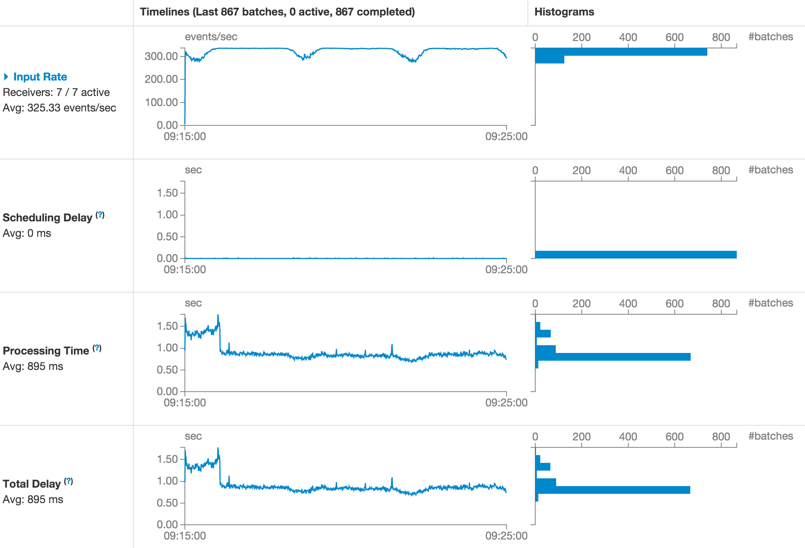
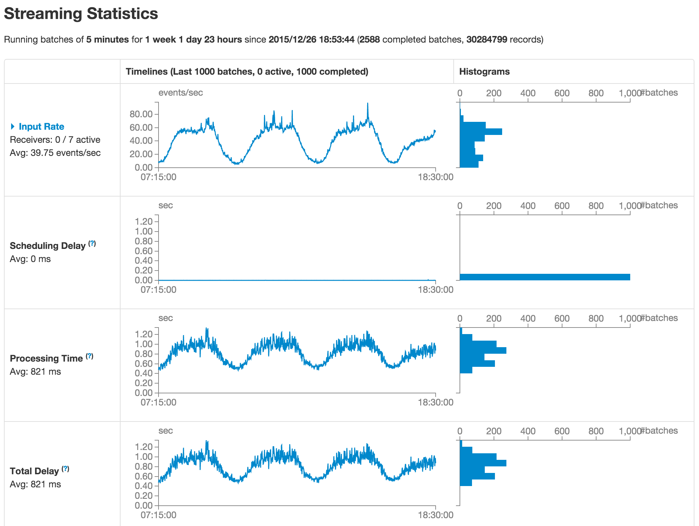

# Tweeather

Tweeather is a Machine Learning project that correlates Twitter sentiment to European weather.

I was inspired by a study where user behaviour on Twitter was used to build a predictive model of income: [Studying
User Income through Language, Behaviour and Affect in Social Media][1]. I decided it was the perfect opportunity to venture into the world of Big Data and so I learned Spark and Hadoop.

## Table of Contents

- [Scripts](#scripts)
	- [1. *Sentiment140* scripts](#1-sentiment140-scripts)
	- [2. *Emo* scripts](#2-emo-scripts)
	- [3. *Fire* scripts](#3-fire-scripts)
- [Configuration files](#configuration-files)
- [Tips](#tips)
- [Suggestions](#suggestions)

## Scripts

The project has 3 sets of scripts.

### 1. *Sentiment140* scripts

These scripts are used to train a Naive Bayes sentiment analyser with the [Sentiment140][2] dataset. Nothing fancy here. The resulting model has an accuracy of 80%.

#### Running

To run the experiment:

```
# Download the datasets
$ sbt "run-main com.aluxian.tweeather.scripts.Sentiment140Downloader"

# Parse the datasets
$ sbt "run-main com.aluxian.tweeather.scripts.Sentiment140Parser"

# Train the sentiment analyser
$ sbt "run-main com.aluxian.tweeather.scripts.Sentiment140Trainer"

# Test the analyser
$ sbt "run-main com.aluxian.tweeather.scripts.Sentiment140Repl"
```

### 2. *Emo* scripts

These scripts are used to train a Naive Bayes sentiment analyser with tweets collected by myself. For training the classifier, I also used the training dataset of 1.6M tweets provided on the Sentiment140 web page, raising the total size of the training dataset to 10M tweets. The resulting model has an accuracy of 79% (tested on the Sentiment140 manually-labelled dataset).

#### Collection

For collecting the tweets, I used [Twitter's Streaming APIs][3] with multiple apps configured. The average throughput was of 325 tweets/sec and I collected over 100M tweets in 4 days. However, after removing all the duplicates, only 8.4M remained.

The stream of tweets I received from the Twitter APIs was filtered by emoji characters. Tweets that contained positive emojis like :grin: were classified as positive (1), and tweets that contained negative emojis like :cry: were classified as negative (0). Tweets that contained both types of emojis were excluded.

This method allowed me to gather a fairly large dataset of labelled tweets, while the accuracy of the model didn't seem to suffer as it is close to the accuracy of most other sentiment analysers.

#### Parsing

Before training the classifier, the tweets were pre-processed:

- the feature space was reduced
  - urls were replaced with `URL`
  - @usernames were replaced with `USERNAME`
  - repeated letters were replaced with just 2 occurences
- text was sanitised
  - punctuation was removed
  - multiple white spaces were replaced with just one
- stop words like "not", "is", "less", and "or" were removed

#### Training

The resulting tweets are used to train a Naive Bayes classifier. The model is saved for future usage.

#### Running

To run the experiment:

```
# Collect tweets; leave this running for a few hours
$ sbt "run-main com.aluxian.tweeather.scripts.TwitterHoseEmoCollector"

# Parse the collected tweets
$ sbt "run-main com.aluxian.tweeather.scripts.TwitterHoseEmoParser"

# Download the Sentiment140 dataset if you haven't already
$ sbt "run-main com.aluxian.tweeather.scripts.Sentiment140Downloader"
$ sbt "run-main com.aluxian.tweeather.scripts.Sentiment140Parser"

# Train the sentiment analyser
$ sbt "run-main com.aluxian.tweeather.scripts.TwitterHoseEmoTrainer"

# Test the analyser
$ sbt "run-main com.aluxian.tweeather.scripts.TwitterHoseEmoRepl"
```

#### Screenshot

Here's a screenshot of my collector running for almost 4 days.



### 3. *Fire* scripts

These scripts are used to train an Artificial Neural Network that predicts the sentiment polarity from 3 weather variables: pressure, temperature and humidity

#### Collection

Tweets are collected using Twitter's Streaming APIs, filtered by location (Europe) and language (English).

#### Parsing

After they are collected, tweets are ran through the sentiment analyser to get their polarity. The parser script uses a [NOAA][4]-provided weather forecast to extract the pressure, temperature and humidity for each tweet's location.

#### Training

After parsing the tweets, they're used to train a multilayer perceptron. The 3 weather variables are used as the input nodes and the polarity is used as the output node. The model is saved for future usage.

#### Running

To run the experiment:

```
# Collect tweets; leave this running for a few hours
$ sbt "run-main com.aluxian.tweeather.scripts.TwitterHoseFireCollector"

# Parse the collected tweets
# This parser uses the "emo" sentiment analyser, make sure
#   you've trained it first or edit the script to use the other model
$ sbt "run-main com.aluxian.tweeather.scripts.TwitterHoseFireParser"

# Train the sentiment analyser
$ sbt "run-main com.aluxian.tweeather.scripts.TwitterHoseFireTrainer"

# Test the analyser
$ sbt "run-main com.aluxian.tweeather.scripts.TwitterHoseFireRepl"
```

#### Screenshot

Here's a screenshot of my collector running for almost 9 days.



## Configuration files

The project has 2 configuration files:

- `src/main/resources/com/aluxian/tweeather/res/twitter.properties` used to provide Twitter credentials for the collector scripts
- `src/main/resources/com/aluxian/tweeather/res/log4j.properties` used to configure logging

## Tips

Keep these in mind:

- use a powerful machine (otherwise, a cluster might be required)
- use the Spark UI to watch your script's progress on [http://localhost:4040](http://localhost:4040)
- you can download my trained models from the [releases page][5]; just place them where the trainers would save them (see the scripts' source code) and you're good to go

## Suggestions

A few suggestions to improve the project:

- The sentiment analyser doesn't recognise negated words. Sentences like "i am not happy" are incorrectly classified as positive. Use a POS-tagger to merge words with their negations before using them for training (e.g. that sentence would become "i am not_happy")
- *Other suggestions are welcome!*


[1]: http://journals.plos.org/plosone/article?id=10.1371/journal.pone.0138717
[2]: http://help.sentiment140.com/for-students/
[3]: https://dev.twitter.com/streaming/overview
[4]: http://www.noaa.gov/
[5]: https://github.com/Aluxian/Tweeather/releases
